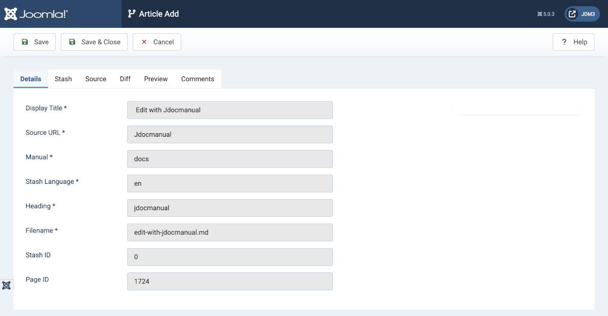
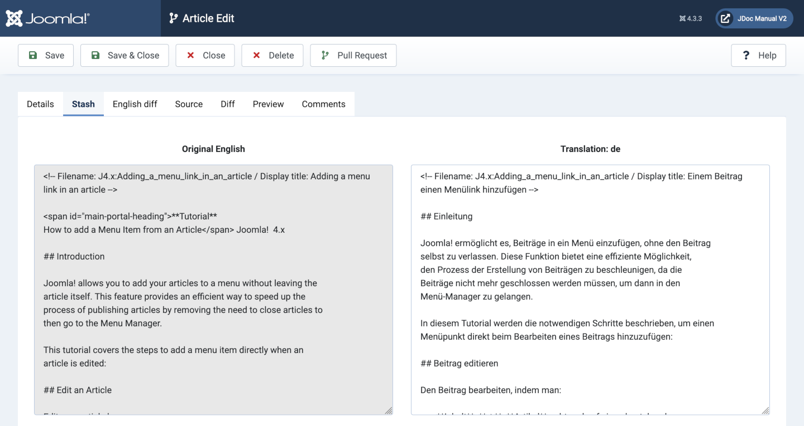

<!-- Display title: Edit Article in Jdocmanual -->

## Updating an Article

In Jdocmanual it is really easy to update an article source file.  Start by creating a
personal **stash** copy of the article. The following screenshot shows the first page
of a list of all articles in a Manual. The list is based on the English original. If English
is selected as  the language then the **Translated** column is not displayed.

The stash copy is stored in the database until it is deleted or committed and
merged into the source. That allows you to come back to make changes over
a period until you are satisfied with the revised content.

If you already have a stash copy of an article there will be a green `Edit Stash` button.
Otherwise there will be a yellow `New Stash` button. When you create a new stash
the original markdown file will be copied for you to work on.

The `New` button in the Toolbar, only available when English is selected,  is used to
create a completely new English article. It works a little differently and only appears
in the `New Pages` tab. More on that later.

Select the `New Stash` or `Edit Stash` button.

## The Article Edit Form

The Article Edit form shows **Article Add** in the title bar for a new stash. It
changes to **Article Edit** after saving. The `Details` tab is all **read
only** data except for a new article in English. On creating a new stash in
German the Display Title will be in English. If a translation already
exists it will be whatever the previous translator set it to.

The `Stash` tab shows the original English text. For a translation the English
and translated texts are displayed side by side.

Note the first line is an HTML comment. This is **important** as it used to
set the article `Display title` when building the database. The display title
may be translated but nothing else in that line. The title is set like this
because there is no H1 in Mediawiki articles. The display title is stored
separately there.

The following illustration shows a German translation with a translated article
title.

The `English diff` tab shows the difference between the last two committed
English versions. This is intended to help the translator see what has changed
in the English source. This tab is not displayed if the selected language is
English.

The `Source` tab shows a **read only** view of the source markdown file.

The `Diff` tab shows the difference between the Stash and the Source. So before
any changes are made this tab is empty - but there is an `Identical` message.

The `Preview` tab show a HTML conversion of the stash showing what the end
users will see.

The `Comments` tab has a field to enter a `Commit Message` and a field to
enter `Comments`. These fields can be filled in by either the user who created
the stash or whoever commits the stash. In some cases a committer may decline
to commit until some correction is made. That can be indicated here.

## Commit a Stash

In a communal environment it is expected that there will be two User Groups,
one allowed to create or edit articles and another allowed to publish articles.
Of course an individual user may belong to both groups.

When a stash owner is satisfied with the text, a pull request is made by
selecting the `Pull Request` button in the Toolbar. Up to that point a
Publisher is not aware of a stash created by another user. After that point
the Pull Request appears in the list in the Pull Requests tab of the list form.

From time to time a Publisher will consult the list of Pull Requests and open
the Edit Stash form. It is the same form seen by the stash owner except that
it has a `Commit` button in the Toolbar. If the Publisher is satisfied with
the stash, a click on the button causes creation of a git branch followed by
staging and committing the revised content. All in a single operation.

## New Articles

A new article can only be created in English via the New button in the Title
bar, only present when English is selected in the Article Stashes list. It is
covered in the next article.
