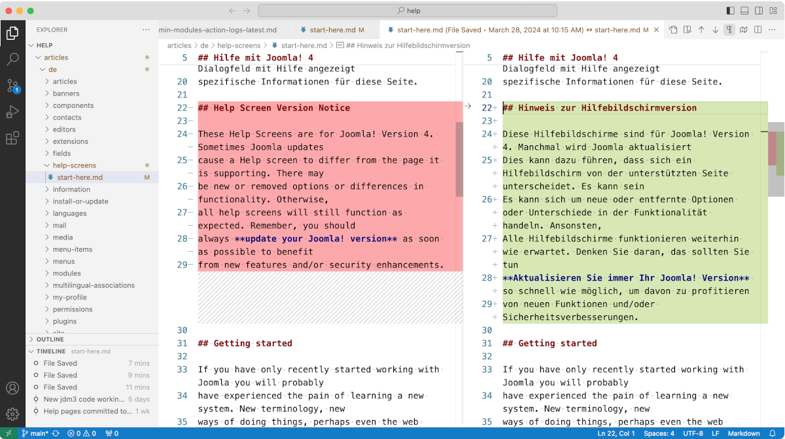

<!-- Display title: Edit in VSCode -->

## About VSCode and VScodium

From WikiPedia:

>Visual Studio Code, also commonly referred to as VS Code, is a source-code editor developed by Microsoft for Windows, Linux and macOS. Features include support for debugging, syntax highlighting, intelligent code completion, snippets, code refactoring, and embedded Git. Users can change the theme, keyboard shortcuts, preferences, and install extensions that add functionality.

VSCodium is a fork of VSCode free of tracking data. It says this:

>Microsoft’s vscode source code is open source (MIT-licensed), but the product available for download (Visual Studio Code) is licensed under this not-FLOSS license and contains telemetry/tracking. According to this comment from a Visual Studio Code maintainer: ...

You can download either or both from the following locations:

- VSCode: https://code.visualstudio.com/
- VScodium: https://vscodium.com/

These two applications are virtually identical. There is no need to mention
any differences here. Where VSCode is mentioned just read VSCodium if that
is your preference.

## Working Method

Although Jdocmanual has an internal system for updating content I ofetn
forget which repository I have updated where and this makes it confusing for
me to keep my test and production sites synchronised. So I have adopted a
working method the suits me:

1. Update content on a local test site on my laptop and test it there.
2. Push changes to my repository on GitHub.
3. On my production site, pull changes from GitHub and rebuild the database
articles and menus tables.

Using VSCode I can preview each page as I make changes. A useful feature.

## Open a Folder

In VSCode select `File/Open Folder` and select the Manual folder you wish to
edit, for example `~/data/manuals/help`. **Important:** if you are using git,
remember that each manual folder contains a hidden .git folder containing the
git record of changes to your copy of the repository.

To the left is the Explorer, a list of folders and files in the base folder.
This example shows work in progress on this article:


## Edit an Article

Open and close folders as you would in any file manager application. If you are
new to VSCode you may wish to review the tutorials and adjust your preferences.
Select an article to edit. If you need a reminder of GFM format rules see the
[Markdown](jdocmanual?article=docs/jdocmanual/markdown "Markdown")
article. With an article active select Shift+cmd+V (on Mac) to open the
Preview window. Note that internal links will not work in the Preview.

## Create an Article

**Important:** An original article must be in English!

To create a new article select a menu heading and right click to see the
`New File...` popup menu. Enter a shot descriptive filename ending in .md.

The first line of the new file should contain a HTML comment containing the
filename of the original source and a Display title. Like this:

```
<!-- Filename: Edit_with_Vscode / Display title: Edit with VSCode -->
```
This may seem strange! It is done this way because the document title is
handled separately in MediaWiki, Docusaurus and othe display systems that
use Markdown source files.

### Add to Article Index

Open the `articles-index.txt` page. Note that this is in the root of the
`articles` folder and serves as an index for all translations. Add an entry
similar to the existing entries of the form:
```
heading=Display_Title=display_title.md
jdocmanual=Edit_with_VSCode=edit-with-vscode.md
```
The order is not particularly important. Best put them in the order in which
the articles appear in the output.

During the build process the articles are read in the order in this file for
conversion to HTMl for storage in the database.

### Add to Menu Index

Open the `menu-index.txt` file. It contains the data needed to build the
menus. The order in which items appear in this file is the order in which
they will appear in the Jdocmanual display. So make an entry in the desired
location. Example:
```
docs=jdocmanual=markdown.md
docs=jdocmanual=edit-with-vscode.md
docs=jdocmanual=article-edit.md
```
If you later want to change the order just cut and paste the appropriate
line and then rebuild the menus in Jdocmanual.

## Add a New Heading

If it is necessary to add a new heading just follow the existing pattern. For
example:
```
heading=some_new_heading=Some New Heading Title
docs=some_new_heading=some_new_article.md
```
### Update menu-headings.ini

Each language has a file containing heading translations. The `en` version
looks like this:
```
jdocmanual=Jdocmanual
some_new_heading=Some New Heading
jdoc-reference=JDOC Reference
jdoc-documentation=JDOC Documentation
jdoc-help=JDOC Help Pages
jdoc-translation=JDOC Translation
```
Other languages keep the part before the = symbol (the key) and translate the
second part (the value).

## Rebuild

If you are working with a local test installation of Jdocmanual you can use the
command line or the Jdocmanual Sources / Edit Source page to rebuild the
articles and then the menus. They must be done in that order!

## Timeline and Translation

A useful feature of VSCode is the Timeline at the bottom of the Explorer panel.
This can show changes between repository commits. If you are translating the
original English into German for example you can see what has changed since the
last English commit and update the German translation accordingly.

Here is an example showing the timeline for a German translation:



In this example the author copied the English text into a new German document
and then began translation paragraph by paragraph.
