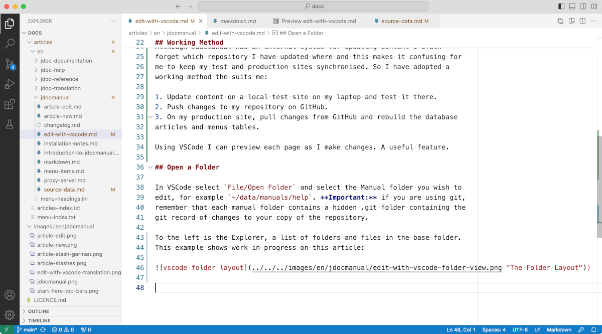

<!-- Filename: Edit_with_Vscode / Display title: Edit with VSCode -->

## About VSCode and VScodium

From WikiPedia:

>Visual Studio Code, also commonly referred to as VS Code, is a source-code editor developed by Microsoft for Windows, Linux and macOS. Features include support for debugging, syntax highlighting, intelligent code completion, snippets, code refactoring, and embedded Git. Users can change the theme, keyboard shortcuts, preferences, and install extensions that add functionality.

VSCodium is a fork of VSCode free of tracking data. It says this:

>Microsoft’s vscode source code is open source (MIT-licensed), but the product available for download (Visual Studio Code) is licensed under this not-FLOSS license and contains telemetry/tracking. According to this comment from a Visual Studio Code maintainer: ...

You can download either or both from the following locations:

- VSCode: https://code.visualstudio.com/
- VScodium: https://vscodium.com/

These two applications are virtually identical. There is no need to mention
any differences here. Where VSCode is mentioned just read VSCodium if that
is your preference.

## Working Method

Although Jdocmanual has an internal system for updating content I ofetn
forget which repository I have updated where and this makes it confusing for
me to keep my test and production sites synchronised. So I have adopted a
working method the suits me:

1. Update content on a local test site on my laptop and test it there.
2. Push changes to my repository on GitHub.
3. On my production site, pull changes from GitHub and rebuild the database
articles and menus tables.

Using VSCode I can preview each page as I make changes. A useful feature.

## Open a Folder

In VSCode select `File/Open Folder` and select the Manual folder you wish to
edit, for example `~/data/manuals/help`. **Important:** if you are using git,
remember that each manual folder contains a hidden .git folder containing the
git record of changes to your copy of the repository.

To the left is the Explorer, a list of folders and files in the base folder.
This example shows work in progress on this article: 
)

Testing ...